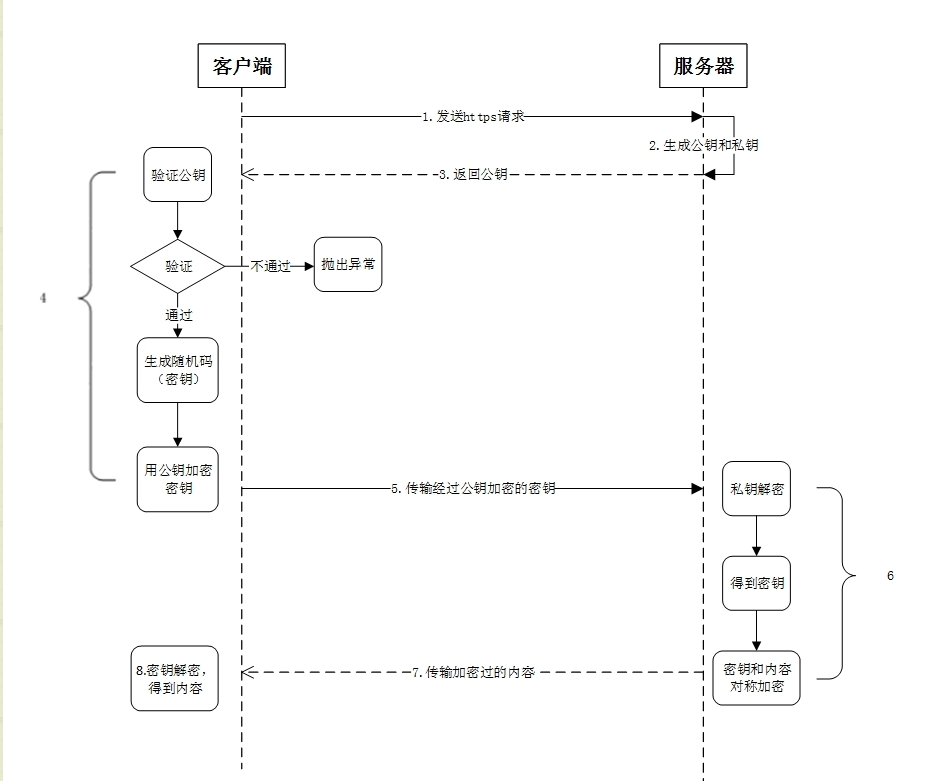
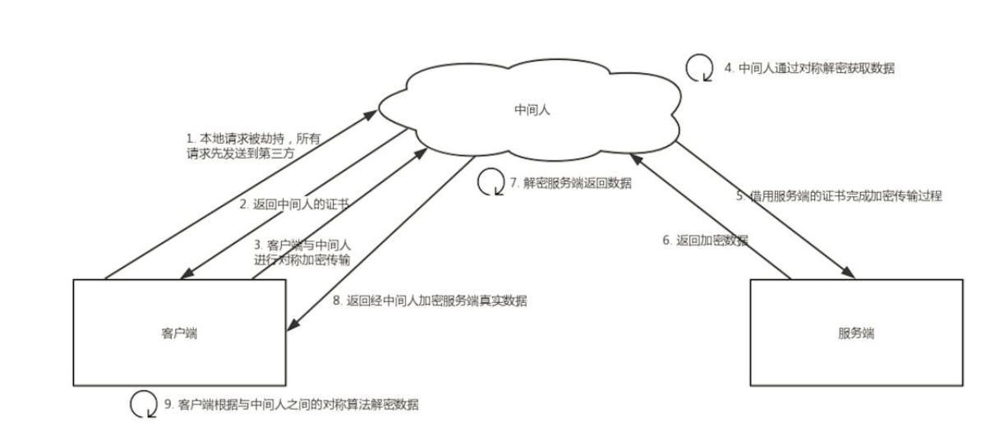
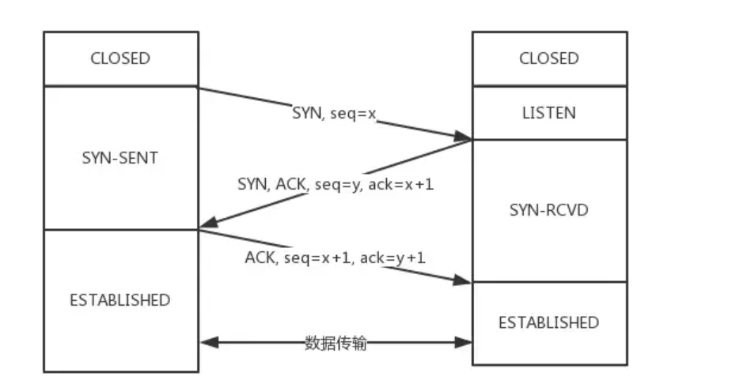
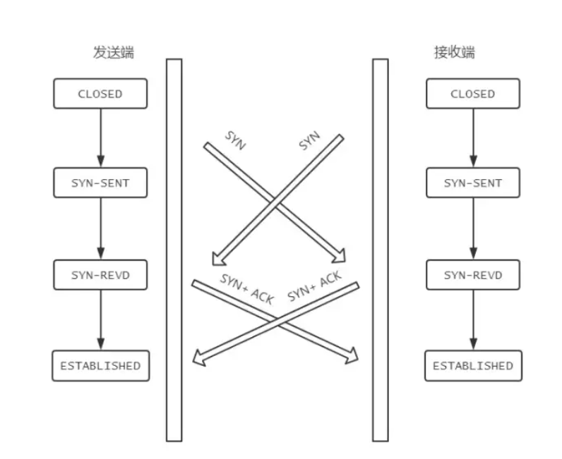
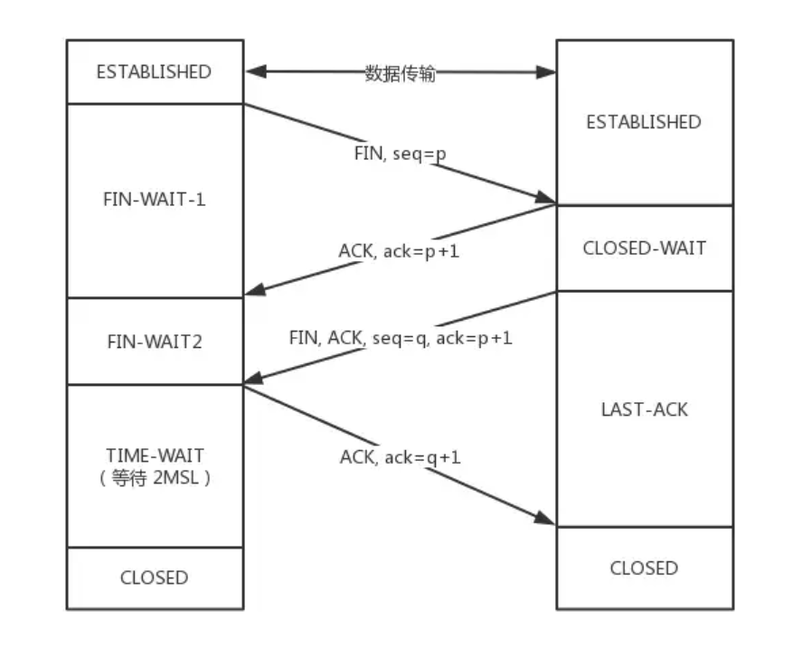
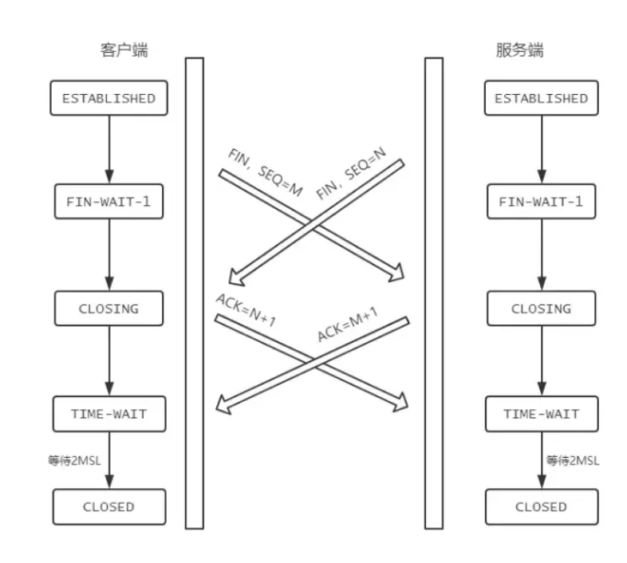
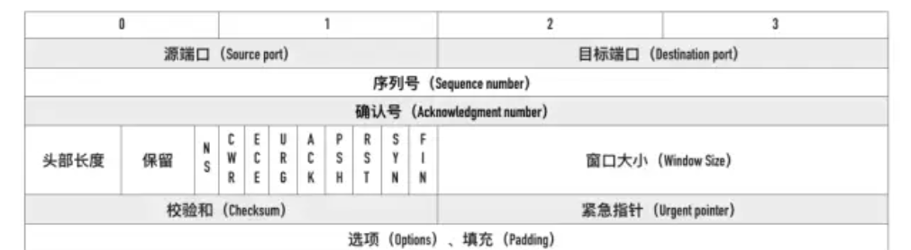

# Https

https://mp.weixin.qq.com/s?__biz=MzIyNDU2ODA4OQ==&mid=2247484659&idx=1&sn=dec902f42a5aa61800eef960199caaaa&chksm=e80db285df7a3b939613f05e333cf7435f6e21d54b332619c30d41c3024b8383d85ecb7ec96c&scene=21#wechat_redirect

Https = http + ssl

http明文传输没有加密

**非对称加密**：使用公钥加密数据，服务端通过私钥解密数据，https的第一次数据传输采用的是非对称加密，是用非对称加密的效率十分低

**对称加密：** 使用密钥（随机码）加密和解密内容 ，在第一次非对称加密过后，都是使用对称加密

==ssl证书中包含了公钥==

**私钥**：再申请ssl证书时，会产生私钥，将私钥安装在服务器上

如果证书不是ca机构认证，会产生中间人攻击

# TCP/IP

https://mp.weixin.qq.com/s?__biz=MzIyNDU2ODA4OQ==&mid=2247484715&idx=1&sn=25ba2617708532046fc1460104021c94&chksm=e80db35ddf7a3a4bd72396b0de4e031de57f8f3c18335f77f4e8a1085e60d7aeceda74b50bfa&scene=21#wechat_redirect

## TCP与UDP

**TCP**：面向连接的、可靠的、基于字节流的传输层协议

**UDP:**  面向无连接、不可靠的。基于数据报的传输层协议。

## TCP

tcp连接是双向的，客户端与服务端既可以发送也可以接收

### Tcp连接如何保证可靠性

1. 序列号
2. 确认应答机制（ACK)
3. 超时重传机制
4. 连接管理机制（3次握手和4次挥手）
5. 流量控制
6. 拥堵控制

### 连接状态

- LISTENING:表示正在监听某一个端口的连接请求
- SYN_SENT:==发送连接==请求后等待匹配的连接请求（ACK）
- SYN_RCVD:==收到连接请求并发送一个连接请求==后，等待对方对连接请求的确认
- ESTABLISHED: 一个打开的连接，数据可以传送给对方

**主动关闭端连接状态**

- FIN-WAIT-1: 等待远程TCP连接中断请求，或先前的连接中断请求的确认(等待发出FIN所对应的AKC)。主动关闭端发出FIN后，进入该状态。
- FIN-WAIT-2: 主动关闭端接收到被动端的ACK后，进入该状态。此时主动关闭端处于==半关闭状态==，没有发送能力，但有接收能力。
- TIME-WAIT:主动端收到FIN、ACK后，发送ACK给被动端。
- CLOSED:主动端在TIME-WAIT状态下，等待2MSL后进入关闭状态

**被动关闭端连接状态**

- CLOSED-WAIT: 被动端接收到主动端的FIN后，并向主动端发送ACK
- LAST-ACK：被动端发送FIN、ACK后

###  三次握手

Client和Server 同时向对方发起连接（发送SYN）

**SYN**: 表示自己有发送的能力，每次发送SYN会产生一个seq序列号；

**ACK:** 表示自己有接收的能力，每次发送ACK，ack的序列号是上一次SYN发来的序列号+1

SYN和ACK是一对

#### **三次握手过程**

**第一次握手**：Client向Server发送SYN包和序列号seq = x，进入SYN-SENT状态(客户端请求连接状态)

**第二次握手：**Server收到Client传来的SYN包后，确认了Client的发送能力，向Client发送SYN、ACK包、序列号seq = y、ack = x +1，Server进入SYN-RCVD状态

**第三次握手：**客户端接收到客户端传来的SYN,ACK包后，确认了服务端的发送能力和接收能力，此时客户端已经进入了Established，

客户端向服务端发送ACK包、ack = y + 1.在第三次握手是可以携带数据传输，在==携带数据时会消耗一个序列号 seq = z。==

服务端接收到ACK包后，服务端也进入了Established状态，此时tcp连接建立成功

在收到对方发送过来的ACK包后，自己才会进入Established状态

**为何不是两次握手：**

- 如果是两次握手，服务端无法确认客户端接收的能力
- ==为了防止两次握手情况下已失效的连接请求报文段突然又传送到服务端==,而使服务端开启连接，造成资源浪费

==假设两次握手就能建立连接==

Client向Server发出TCP连接请求，第一个连接请求SYN包在网络中长时间滞留，Client超时后该报文丢失，重传一次连接请求，Server收到第二次发送的SYN后进入Established状态，并向Client发送SYN、和ACK。Client收到后也进图了Established状态。数据传输结束后，Client与Server都关闭了连接，这时候若第一个SYN被Server接收到，Server就进入Established状态等待Client传输数据，但这时候Client是Closed状态，并不发送数据。造成了Server端的资源浪费

### 四次挥手

Client和Server同时发起关闭连接

**Client 和 Server端均可以主动发起关闭连接的请求**

#### **四次挥手过程**

**第一次挥手：** 主动方 向 被动方 发送FIN、seq = p，Client从ESTABLISHED进入FIN-WAIT-1状态

**第二次挥手：** 被动方 接收到 主动方  发来的FIN后，被动方向主动方发送 ACK，seq = p + 1，并进入CLOSED-WAIT。主动方接收到被动方的ACK后进入FIN-WAIT-2(半关闭状态)，主动方不能发送数据，但是可以接收数据。

**第三次挥手：**被动方将数据发送完后，向主动方发送FIN、ACK，被动方进入LACT-ACK状态，

**第四次挥手：** 主动方接收到FIN、ACK后进入TIME-WAIT状态，并向被动方发送ACK。

被动方接收到ACK后进入CLOSED状态， 主动方在等待2MSL后也进入CLOSED状态

#### TIME-WAIT时等待2MSL（Maximum Segment Lifetime、最大报文生存时间）的意义 

-  ==确保主动方发送的ACK能到达被动方==。当ACK在网络中滞留或者丢失，被动方超时没有收到ACK就会重传FIN、ACK包。如果不等待2MSL，被动方会因为没有收到主动方的ACK而不能正常关闭
- 发送完ACK后，经过2MSL，可以是本连接持续时间内产生的所有报文失效

1MSL:  确保主动方的ACK能到达被动方

1MSL：确保被动方因为超时没有收到ACK 而重传的FIN、ACK可以到达主动方。

### 半连接队列（SYN队列）、全连接队列（ACCEPT队列)、SYN Flood攻击

**半连接队列：**Server收到Client的SYN,并回复ACK和SYN，Server状态由LISTEN变为SYN_RCVD，此时该连接被推如SYN队列

**全连接队列：**Server收到Client回复的ACK，三次握手完成，该连接从半连接队列推入全连接队列，等待被具体的应用取走

Dos攻击（Denial of Service)

**SYN Flood攻击:**  Client短时间内伪造大量==不存在的IP地址，向Server端发送SYN。==

对于Server端来说产生的危险：

1. Server端处理大量的SYN，并回复ACK和SYN，会有大量连接处于SYN_RCVD，占满半连接队列
2. 因为是不存在的ip地址，Server端长时间收不到Client的ACK，会不断的超时重传，从而耗光Server端资源

**预防SYN Flood**：

1. 增加半连接队列容量
2. 减少SYN+ACK 的重试次数，避免大量的超时重传

### TCP头部报文字段

- 源端口和目标端口： 用四元组 ip：port + ip ：port 表示唯一一个连接，ip地址在网络层就已经处理，所以传输层TCP不需要记录IP
- 序列号：保证数据包从源端口==乱序发送==到目标端口后，按照正确的顺序组装起来
- 确认号：用来告知对方下一个期望接收的序列号，**小于ACK**的所有字节已经全部收到。
- 窗口大小: 滑动窗口的大小

### TCP中的流量控制

 对于发送端和接收端而言，TCP 需要把发送的数据放到**发送缓存区**, 将接收的数据放到**接收缓存区**。

而流量控制所要做的事情，就是在==通过接收缓存区的大小，控制发送端的发送==。如果对方的接收缓存区满了，就不能再继续发送了。

### TCP中的拥塞控制

- 慢启动
- 拥塞避免
- 快速重传和快速恢复