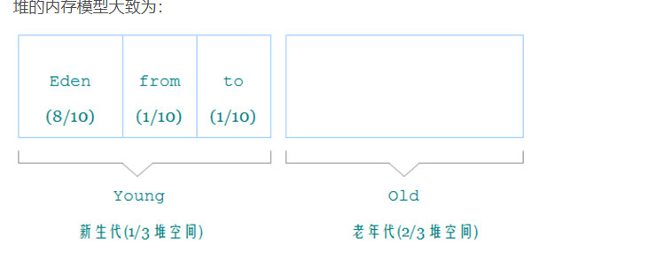

# JVM

## JVM内存模型

### 线程共享

- **方法区**

存储已被虚拟机加载的类信息，常量，静态变量，运行时常量池

- **堆内存**

存放对象的实例，对象在堆内存中的布局可以分为对象头，实例数据，

对象头中存放对象自身运行时的数据如GC分代年龄，锁状态，线程持有的锁，偏向锁id。另一部分存储对象的类型指针

表明该对象是哪个类的实例

字符串常量池在堆内存中

### 线程独占

- **程序计数器**

当前线程执行字节码文件的行号指示器，利用程序计数器来完成

- **虚拟机栈**

一个线程一个虚拟机栈，每一个方法被执行时会创建一个栈帧

栈帧中包括局部变量表，操作数栈，动态连接

- **本地方法栈**

与虚拟机栈类似，本地方法栈执行的是本地方法（native）

### 直接内存

内核态的内存而不是用户态内存

## 垃圾回收

### 判断对象是否存活

- **引用计数法**

  给对象添加一个计数器，有地方引用当前对象就+1，当计数器的值为0时，表示该对象不再被引用

  无法解决循环引用的问题

  

  

- **可达性分析法**

  GCroot到当前对象之间是否存在引用链，或者说GCroot当前对象是否可达，若可达表示该对象存活

  可以做为GCroot的对象：

  - 虚拟机栈（栈帧中的局部变量表）所引用的对象
  - 方法区中类静态属性引用的对象
  - 方法区中常量引用的对象

  

### 对象的引用类型

- **强引用**

  Object c = new object();

- **软引用**

  被软引用关联的对象会存活到oom(out of memory) 之前

- **弱引用**

  只能存活到下一次垃圾回收之前

- **虚引用**

  不会影响对象的存活时间，被虚引用关联的对象会被收集器回收时反馈一个系统通知

  

### 方法区中的垃圾回收

- **废弃的常量**

  没有其他地方引用该常量

- **不再使用的类**

  该类的所有实例都已经被回收

  该类的类加载器已经被回收

  该类对应的.Class对象没有在其他地方引用

  

### 垃圾回收算法

- **标记清除**

  会造成内存碎片化  CMS(Concurrent Mark Sweep)垃圾回收器用的是该算法

  

- **标记复制**

  新生代垃圾回收算法

  将存活对象复制到空内存中，减少碎片化

  

- **标记整理**

  老年代垃圾回收算法

  将存活的对象全部移动到一边，再将所有垃圾清除

  

### 堆内存分代

- **新生代  会触发MinorGC ** 

新生代中每次都有大量的对象死去

新生代分为1个Eden区和2个Survivor区（from，to）   eden : survivor  = 8 : 1

新生代使用的是标记复制算法，用两个Survivor区可以保证有一块survivor区永远是空的

在新生代中熬过一次GC，GC年龄+1；

- **老年代 会触发MajorGC**

大对象直接进入老年代，在新生代中gc年龄  >= 15的对象也会进入老年代

==如果Survivor中相同年龄所有对象大小的总和大于Survivor空间的一半，年龄大于等于该年龄的对象就可以直接进入老年代==

- **FullGC 整堆清除** 清除整个java堆和方法区中的垃圾

### SafePoint

必须到达safepoint才能开始垃圾回收，用户线程跑到最近的safepoint后然后将自己挂起

### Stop the World

暂停所有用户线程，只让垃圾线程进行工作

### 垃圾收集器

- **Serial与SerialOld**

**Serial：**单线程工作，用于新生代垃圾回收，必须暂停其他所有工作线程，直到垃圾回收结束

**SerialOld：**serial 的老年代版本，负责收集老年代垃圾，与Serial类似，也是单线程

- **ParNew**

Serial的并行版本，负责新生代垃圾回收，

- **Parallel Scavenge和Parallel Old** ==吞吐量优先收集器==

**Paralle Scavenge:** 以吞吐量为优先的垃圾收集器
$$
吞吐量=运行用户代码时间/（运行用户代码时间+垃圾回收时间）
$$
**Parallel Old：**老年代版本

- **CMS**（Concurrent Mark Sweep）==并发标记清理== 老年代垃圾收集器

以最短回收停顿时间为目标，基于标记清理算法实现

清理过程分为：

1. 初始标记：仅仅标记GC Roots直接关联的对象
2. 并发标记：从GC Roots之间关联的对象开始遍历整个对象图
3. 重新标记：重新标记在并发标记阶段用户线程产生的垃圾
4. 并发清除：清除标记阶段判断已经死亡的对象

**浮动垃圾：**在并发清理阶段产生的垃圾只能在下一次GC中被清除

- **G1**（garbage frist) 基于reigon清理垃圾 分区域清理而不是分代清理

面向局部收集

判断哪块region中的垃圾数量最多，回收效益最大的有限回收

每一块region都可以根据需要扮演不同的角色（eden，from，to，老年代）

清理过程：

1. 初试标记：仅仅标记GC Roots直接关联的对象
2. 并发标记：从GC Roots之间关联的对象开始遍历整个对象图
3. 最终标记：标记并发阶段用户线程产生的垃圾
4. 筛选回收：对各个region的回收价值和成本排序，根据用户所期望的停顿时间进行回收

## 类加载

类的加载：将类的.class文件加载到内存中生成Class对象

### 类的生命周期

- **加载**

  1. 通过类的全限定类名找到该类的.class文件
  2. 将.class文件加载到内存中生成Class对象

- **连接**

  1. 验证：验证.class文件的正确性
  2. 解析：为类中的静态变量分配内存并设置初始值（0，null，false）
  3. 解析：讲常量池中的符号引用改为直接引用

- **初始化**

  ​	执行类构造器<clinit>()方法，为静态变量赋予自己的值

- **使用**

- **卸载**

### 类加载器

- BootStrap：

  ​	加载核心Java SE和JDK模块。

- Platform：

  ​	加载部分Java SE和JDK模块。

- Application：

  ​	加载用户的类和模块路径中的模块。

### 双亲委派

当一个类加载器收到了加载请求，该类加载器首先不会尝试自己加载该类，而是交给父类加载器加载，层层递进，所有的类加载请求最终都会传导Bootstrap Class Loader中 只有当父类加载器无法加载这个类的时候，子类加载器才会尝试加载这个类。

例如Object类，无论哪个类加载器加载这个类，保证被加载的类一定是核心类库中的Object而不是用户自己写的Object类

#### 打破双亲委派机制

继承ClassLoader类，用户自己定义一个类加载器

重写findClass()和loadClass()