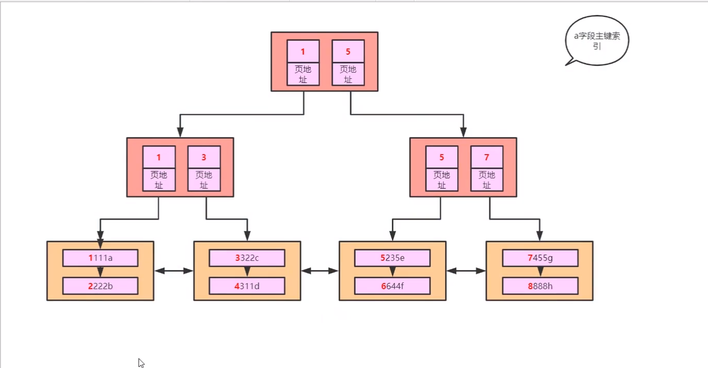

##  MYSQL索引

https://mp.weixin.qq.com/s?__biz=MzIyNDU2ODA4OQ==&mid=2247484733&idx=1&sn=041d3fae1e5c2c7ea970dede78c4768b&chksm=e80db34bdf7a3a5d59dce0a3247739cac69a5b7abce9d518d10f8af827a05862bffd0bca88e4&scene=21#wechat_redirect

### 索引类型

1. 普通索引
2. 联合索引
3. 唯一索引 ，索引列允许为null
4. 主键索引，不为null且唯一
5. 全文索引
6. 空间索引
7. 单列索引

### 建立索引的原则

1. 选择唯一性索引
2. 为经常需要排序，分组、联合操作的字段建立索引
3. 为经常查询的字段建立索引
4. 限制索引的数目
5. 尽量使用前缀来索引
6. 最左前缀原则
7. =和in可以乱序  where a= 1 and b = 2 与 where b = 2 and a = 1 是一样的效果只要满足最左前缀原则
8. 索引列不参与计算

###  索引失效

字段是 char(varchar) 而条件中用了数字

like“%123“ 模糊查询匹配后半段

没有满足最左前缀原则

a = 1 and b > 2 and c = 3   a,b都用到了索引，c没有用到，因为b进行了范围查询

 ### innoDB主键索引

建立主键索引后，在插入数据时会按照主键排序(默认按照升序插入)

索引是为了加快查找速度

B+树 一个节点存一页数据，一页数据大小默认16kb

索引页：存储索引的页

 数据页：存储数据的页 

==数据页形成双向链表==

#### B+树

B+树只在叶子节点存储数据，非叶子节点存储索引，叶子节点形成双向链表

B+树是完全平衡树，树的平均高度低 

 

而B树，在非叶子节点也存储数据，一颗B树所使用的内存比B+树要大的多其树的高度也要大

### Innodb创建B+树

利用磁盘预读，一次io最少读取一页数据，如果一行一行的读取数据，io效率十分低

### 聚集索引（聚簇索引）

**非聚集索引和聚集索引的区别**在于， 通过聚集索引可以查到需要查找的数据， 而通过非聚集索引可以查到记录对应的主键值 ， 再使用主键的值通过聚集索引查找到需要的数据（回表），如下图

#### 查询

通过索引查询或全表查询（只通过数据页 一页一页查找数据）

select * from _ where a < 5 范围查找也使用了索引

### 联合索引

create index i on t( b,c,d)   按照t联合索引进行排序  生成b+树

#### 最左前缀原则

先比较b 再 比较 c, d 使用联合索引时必须要有b 即要满足最左前缀原则

 

 select * from (联合索引) 时需要进行回表操作

## 使用explain分析查询语句

前面已经演示过如何使用`explain`命令分析查询语句了，这里再解释一下其中几个有参考价值的字段的含义：

### select_type

select_type表示查询中每个select子句的类型，一般有下面几个值:

- **SIMPLE**
  简单SELECT,不使用UNION或子查询等。
- **PRIMARY**
  查询中若包含任何复杂的子部分,最外层的select被标记为PRIMARY。
- **UNION**
  UNION中的第二个或后面的SELECT语句。
- **DEPENDENT UNION**
  UNION中的第二个或后面的SELECT语句，取决于外面的查询。
- **UNION RESULT**
  UNION的结果。
- **SUBQUERY**
  子查询中的第一个SELECT。
- **DEPENDENT SUBQUERY**
  子查询中的第一个SELECT，取决于外面的查询。
- **DERIVED**
  派生表的SELECT, FROM子句的子查询。
- **UNCACHEABLE SUBQUERY**
  一个子查询的结果不能被缓存，必须重新评估外链接的第一行。

### type

type表示MySQL在表中找到所需行的方式，又称“访问类型”，常用的类型有：

ALL, index, range, ref, eq_ref, const, system, NULL。

从左到右，性能从差到好。

- **ALL：**
  Full Table Scan，MySQL将遍历全表以找到匹配的行。
- index:
  Full Index Scan，index与ALL区别为index类型只遍历索引树。
- **range:**
  只检索给定范围的行，使用一个索引来选择行。
- **ref:**
  表示上述表的连接匹配条件，即哪些列或常量被用于查找索引列上的值。
- **eq_ref:**
  类似ref，区别就在使用的索引是唯一索引，对于每个索引键值，表中只有一条记录匹配，简单来说，就是多表连接中使用primary key或者 unique key作为关联条件。
- **const:**
  当MySQL对查询某部分进行优化，并转换为一个常量时，使用这些类型访问。
  如将主键置于where列表中，MySQL就能将该查询转换为一个常量。
- **NULL:**
  MySQL在优化过程中分解语句，执行时甚至不用访问表或索引，例如从一个索引列里选取最小值可以通过单独索引查找完成。

### Key

key列显示MySQL实际决定使用的键（索引），如果没有选择索引，键是NULL。

### possible_keys

possible_keys指出MySQL能使用哪个索引在表中找到记录，查询涉及到的字段上如果存在索引则该索引将被列出，但不一定被查询使用。

### ref

ref表示上述表的连接匹配条件，即哪些列或常量被用于查找索引列上的值。

rows

rows表示MySQL根据表统计信息，以及索引选用的情况，找到所需记录需要读取的行数。这个行数是估算的值，实际行数可能不同。

## MYSQL 引擎

**MyISAM：**

- 不支持事务
- 支持表级锁
- 使用非聚簇索引，主键索引文件的数据域存储指向数据文件的指针， 需要经过回表操作
- 适合读多的场景
- 保存数据行数

**InnoDB：**

- 支持acid事务
- 支持行级锁，间隙锁，外键约束
- 主键索引采用聚簇索引
- 适合写多的场景
- 不保存数据行数，在select count(*) from table 时会造成全表扫描

 ## Int和CHAR的隐式类型转换

1、当查询字段是INT类型，如果查询条件为CHAR，将查询条件转换为INT，如果是字符串前导都是数字，将截取前导数字用来比较，如果没有前导数字，则转换为0。

2.、当查询字段是CHAR/VARCHAR类型，如果查询条件为INT，将查询字段转换为INT再进行比较，可能会造成全表扫描。

## 索引覆盖

使用非聚簇索引时没有经过回表操作，在叶子节点能找到所需要的数据，回表操作耗时

## 事务：一个逻辑单元执行的一系列操作

### InnoDB中的默认隔离级别是可重复读

ACID

原子性：一组操作要么全部成功要么全部失败， 通过undo log实现

持久性：通过redo log 实现，事务操作永久保存

隔离性：两个事务之间的操作不会相互干扰

一致性：事务完成后，所有的数据保持一致状态

事务隔离级别：

未提交读：读到了另外一个事务未提交的值，会出现脏读

读已提交 ：一个事务只能读到另外一个事务已经提交的数据。通过加行级锁解决，会出现不可重复读，幻读

可重复读：一个事务读取了一个数据，另一个事务必须等前一个事务提交后才能读到这个数据，加间隙锁 解决幻读

串行化：不支持并发操作，是串行的

通过设置savepoint 可以保证事务不会全部回滚而是回滚到保存点

### 不可重复读 

一个事务对同一条数据前后读出的数值不同，因为第二次读时有其他事务修改了这条数据

## mysql 可重复读就已经解决了幻读现象

## mvvc

使用版本链而不是加锁的方式，实现了多个事务的并发读写

https://www.processon.com/view/link/5eef4a2d6376891e81dc7d28

**两个隐藏列**：1.记录对这条记录改动(增删改操作)的事务ID         2.利用undolog 记录在这条记录改动前的回滚指针

**m_ids**:记录当前活跃事务（未提交事务）的数组

**min_trx_id:**  m_ids数组中最小值

**==max_trx_id==**  下一次readview生成时的事务id

### 数据库锁

**共享锁 （ 读锁）**

一行数据可以有多个s锁

**排它锁（写锁）**

一行数据只能有一个X锁

 **意向排他锁、意向共享锁**

在对一行数据加X或S锁时，需要先对整个表加上IX或IS锁

**InnoDB中的行锁通过对索引加锁**  ，因为通过索引可以找到具体的一条记录

**行锁的实现需要注意：**

1. ==行锁必须有索引才能实现==，否则会自动锁全表，那么就不是行锁了。
2. 两个事务不能锁同一个索引。
3. insert，delete，update在事务中都会自动默认加上排它锁。

## mySQL主从复制

从节点读取主节点中binlog日志，进行io完成主从复制

## 分库分表

### 水平切分

 

### 垂直切分

  按照功能模块切分

## mysql日志

undo log：实现事务的原子性

redo log： 实现事物的持久性

query log 

slow querylog

bin log： 主从复制时，主机将自己的bin log发送给从机进行复制

error log

## UNION与UNION ALL

**UNION:** 两个无关联的表查询，查询结果会去重

**UNION ALL：** 查询结果不会去重，返回所有记录，效果比UNION好