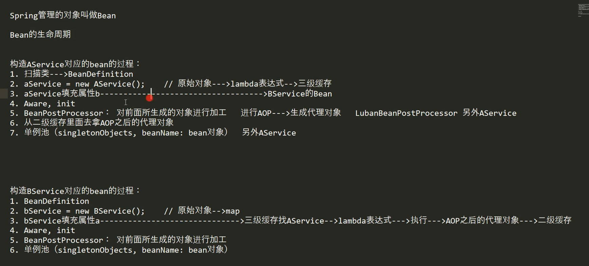
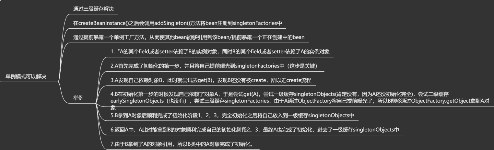
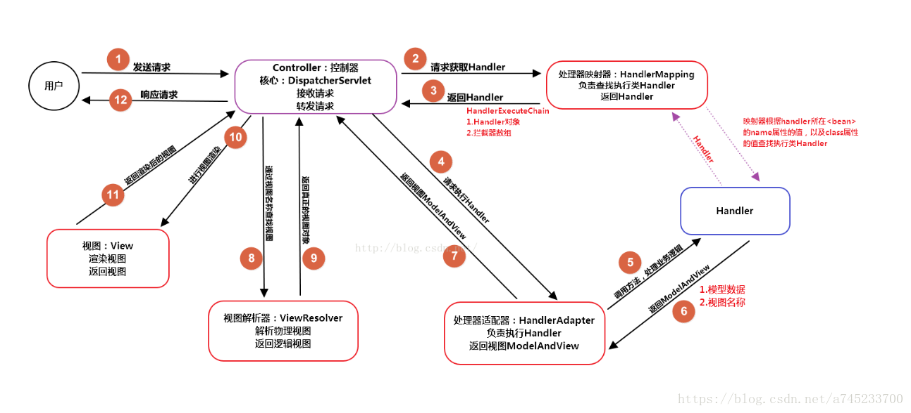
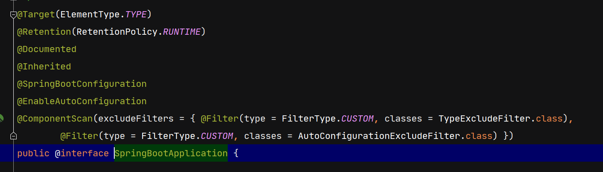
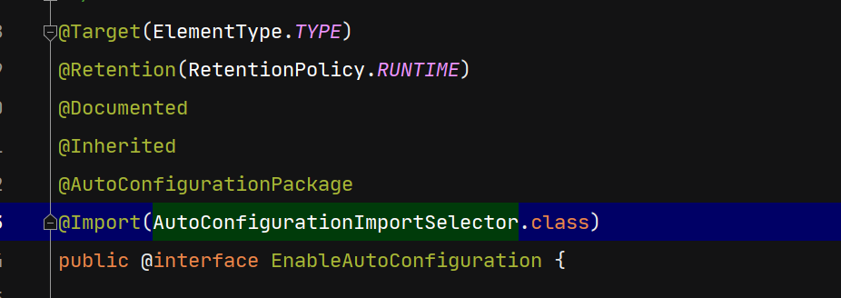
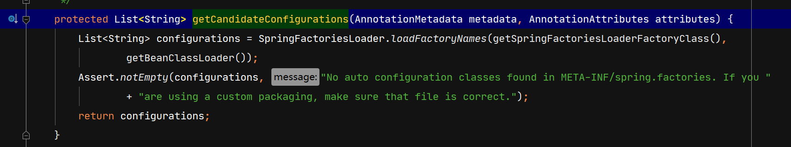
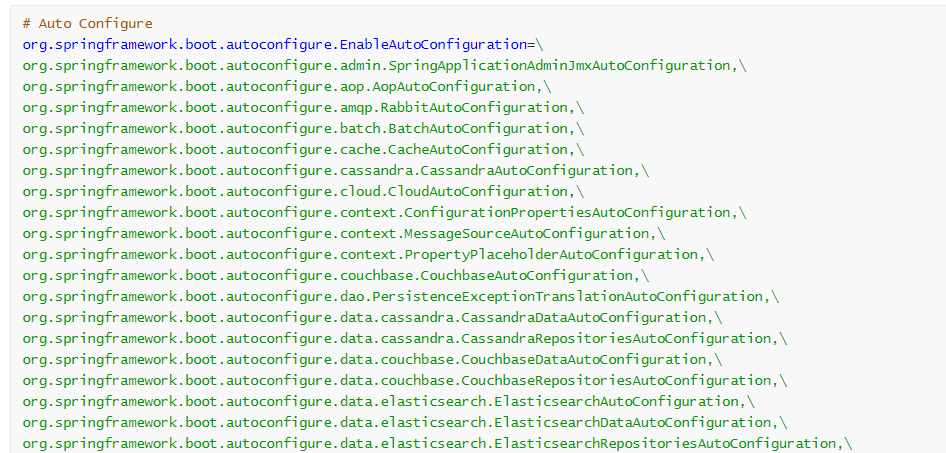
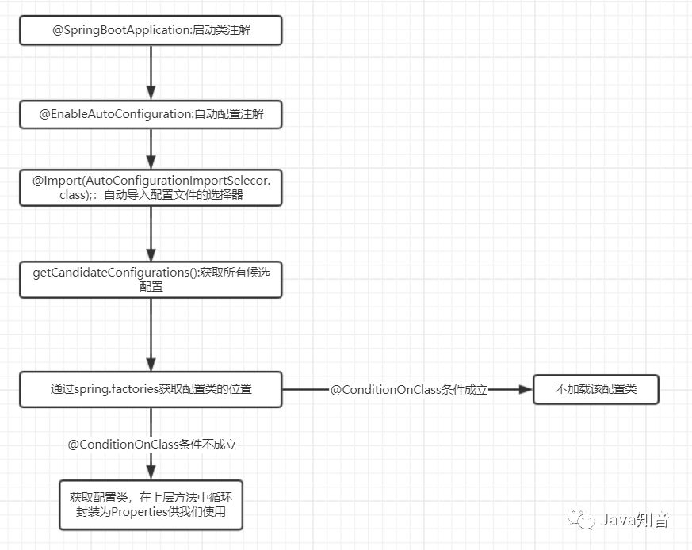

# Spring

## IOC

控制反转（依赖注入），将对象的实例化交给Spring容器管理，一个bean在实例化的时候需要另外一个bean，spring容器将另外一个bean注入到前一个bean中

ioc基于反射，由于反射获得一个类很慢，所以单例的bean在获取到后会加入到单例池singletonObject中

## AOP

面向切面编程，基于动态代理实现。将同样的代码抽取出来，只关注不同的部分。如数据库连接，可以将加载驱动，获得连接，关闭资源等操作、如数据库事务，将开启事务、回滚事务、提交事务抽取出来

==主要是为了重用代码，把公共的代码抽取出来==

用户只需要编写具体的sql语句；

连接点：被拦截的类中所有方法；

切点：在连接点钟需要被增强的方法；

advice：before、afterReturning、afterThrowing、after

切面：切点和通知的结合；

引入aop依赖并 设置spring.aop.auto = true即可开启spring中aop功能

@Aspect 表示该类是一个切面类

spring aop 使用动态代理的方式实现 只能动态织入，必须作用在Bean 上

 aspectJ 属于静态织入 可以在任何java对象上通知

如果被代理对象实现了接口，默认使用jdk代理，若没有实现接口，则使用cglib代理

#### jdk动态代理和CGlib动态代理

jdk代理：基于反射实现，生成一个实现==代理接口==的匿名类，重写拦截的方法。==只能是针对接口编程==

CGlib：基于字节码与继承机制实现，继承被代理的类，被代理的类与要增强的方法不能使用final

底层基于asm框架，将被代理类的class加载，通过修改其字节码文件生成子类实现

## 依赖注入方式

- ### 构造方法注入

  1. 保证依赖不可变
  2. 保证依赖不为空（不为null才可以构建该bean）
  3. 避免循环依赖

- ### setter注入

  1. 通过该类的set方法注入

## 自动装配 @Autowired

使用@Autowired时默认byType注入，如果一个type有多个实现类，则需要指定beanName并配合@Qualifier指定要装配的bean

使用@Primary，则表示优先注入某个类

标注在成员变量上，表示使用setter注入

标注在构造方法上，表示使用构造方法注入

- no
- byType
- byName
- constructor

## Spring中使用的动态代理

JavaSDK代理：只能为接口创建代理，为接口动态的创建实现类

CGlib代理：为一个类创建代理，动态的创建一个新类，继承了该类，重写了方法

JDK的动态代理机制只能==代理实现了接口的类==，而不能实现接口的类就不能实现JDK的动态代理，==cglib是针对类来实现代理的==，他的原理是对指定的目标类生成一个子类，并覆盖其中方法实现增强，但因为采用的是继承，所以不能对final修饰的类进行代理。 

## Bean

被spring容器管理的都是bean

### 生命周期

1. 根据@ComponentScan扫描指定的包，得到BeanDefination并将其加入到bdMap中
2. 初始化BeanFactory
3. 执行beanFactoryPostProcessor
4. 创建Bean实例，加入到singletonFactory存储bean的原始对象
5. 如果bean进行了aop，得到aop后的代理对象放入earlySingletonObjects，当其他bean需要注入当前bean时，注入的就是代理后的对象
6. 依赖注入
7. 如果实现了@BeanNameAware 执行setBeanName（）
8. 如果实现了@BeanFactoryAware 执行setBeanFactory（
9. 如果实现了@ApplicationContextAware 执行setApplicationContext（）
10. 执行BeanPostProcessor中的postBeanBeforeInit（）==BeanPostProcessor对所有的bean都生效==
11. bean的初始化方法
12. 如果实现了InitializingBean接口，执行afterPropertiesSet（）
13. 执行BeanPostProcessor中的postBeanAfterInit（）==BeanPostProcessor对所有的bean都生效==
14. 将bean实例加入到singletonObjects单例池中；
15. 容器关闭时，调用bean的销毁方法

### 作用域

1. singleton
2. prototype
3. request
4. session
5. global-session

## Spring中事务

### @Transactional

该注解表示开启事务功能，使用该注解前必须保证spring开启了aop功能

### 事务的传播行为

一个方法调用另外一个方法，让事务采取不同的策略

REQUIRED:    需要事务，==默认的传播行为==，如果当前存在事务则沿用，不存在则新建一个事务

REQUIRED_NEW：无论当前是否存在事务都会新建一个事务

SUPPORTS:    支持事务，如果当前存在事务则沿用，不存在则不使用事务

NOT_SUPPORTED:  不支持事务，如果当前存在事务，则将事务挂起运行方法

NEVER:  不支持事务，如果当前存在事务，则会抛出异常

NESTED:  嵌套事务，子事务发生异常只会回滚到子事务执行前的状态（savePoint），不会造成当前事务回滚

**REQUIRED_NEW与NESTED的区别**

REQUIRED_NEW 每次都新建一个事务，可以拥有自己的隔离级别和锁等特性

NESTED 会沿用当前事务的隔离级别和锁等特性

### spring中事务失效的情况

1. 数据库不支持事务，如mysql中用了MyIsam引擎，将引擎改为InnoDb
2. 方法不是public    `@Transactional` 只能用于 public 的方法上，否则事务不会失效，如果要用在非 public 方法上，可以开启 `AspectJ` 代理模式。

## beanFactory 和 FactoryBean

beanFactory :生产bean的工厂

FactoryBean：本身也是一个bean ，生产指定的bean

## 循环依赖

解决了循环依赖是，aop对象的问题

# SpirngMVC

## Controller 与 Handler

**Controller** 表示一个类

**Handler** 则是Contrller中具体的方法

## 工作流程

1. 用户请求先经过DispatcherServlet
2. DispatcherServlet收到请求后调用HandlerMapping，请求获取Handler
3. HandlerMapping根据请求url找到具体的Handler，==生成Handler对象==和HandlerExecuteChain拦截器处理链对象，将这些对象返回给DispatcherServlet
4. DispatcherServlet调用HandlerAdapter
5. HandlerAdapter==调用具体的Handler==，执行Handle方法
6. Handler执行完返回ModelAndView对象
7. HandlerAdapter将ModelAndView对象返回给DispatcherServlet
8. DispatcherServlet将ModelAndView对象发送给ViewResolver
9. ViewResolver解析后返回具体的View
10. DispatcherServlet对view进行数据渲染
11. DisptacherServlet响应用户

# SpringBoot

## @SpringBootApplication

resource /  META-INF/spring.factories 

## 自动配置原理

 	

`@EnableAutoConfiguration`注解表示开启了自动配置

`AutoConfigurationImportSelector.class`类中的**getCandidateConfigurations()**方法用来获取在==META-INF/spring.factories==中的所有候选配置

==spring.fatcories==中存放的都是SpringBoot提前写好的自动配置类的全限定类名

将 类路径下  META-INF/spring.factories 里面配置的所有EnableAutoConfiguration的值加入到了容器中；

@ConditionalOnXXX:如果其中的条件都满足，该类才会生效。

所以在加载自动配置类的时候，并不是将spring.factories的配置全量加载进来，而是通过这个注解的判断，如果条件满足，才会进行加载。

### 场景启动器  springboot- xxxx -starter

对应的starter中只负责映入所需要的依赖，没有其他功能