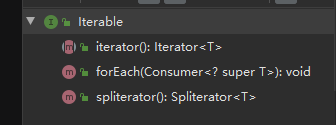
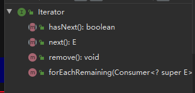

## String 、StringBuffer、StringBuilder的区别

这三个类都是final类不能被继承 , String 实现了Comparable接口，可以进行排序

==String 中的byte[ ]数组是被final修饰的==，不可以更改，而两个SB则是可以==动态扩容的byte[ ]==,初始byte[]大小默认是16；

StringBuffer中的方法被synchronized修饰，是线程安全的，而StringBuilder则没有。单线程环境下StringBuilder的效率比StringBuffer的效率高

StringBuffer与StringBuilder都继承自AbstractStringBuilder


## Comparable 和 Comparator

comparable 属于 类的内部比较器，实现了改接口的类可以使用Collections.sort()方法进行排序。

当一个类无法进行更改，而又想要比较大小，需要实现Comparator接口，是类的外比较器，自定义比较规则。

TreeMap中可以传入Cpmparator 来自定义排序的规则


## Iterator 和Iterable






iterable 接口中包含了Iterator


## == 和equals（） 的区别

比较基本类型时，==比较的是值，在比较引用类型时， ==比较的是在堆内存中的地址是否相同，

若equals（）没有被重写，equals（）与==号的作用相同，而被重写后，equals（）则比较的是两个对象的内容是否相同


## equals（）与hashCode（）

hashCode（）的作用是获得一个散列值，当需要将该对象加入到哈希表时，需要散列值来确定在哈希表中的位置。

hashmap在put时先判断对象的hash值是否相同，若相同则在调用equals（）方法判断对象的内容是否相同，两个都相同，才认为是同一个对象，然后进行替换。

如果没有重写hashcode，即使两个对象的内容相同，其hashcode一定不相等；

通过hashcode（）与equals() 必须能唯一确定一个对象

1.若两个对象相同，则hashcode一定相同

2.两个对象的hashcode相同，两个对象不一定相同

3.重写equals方法必须也重写hashcode


## 序列化与反序列化

实现Serializabel接口即可序列化,并需要指定一个序列化id

序列化：将java对象的状态永久保存到一个字节序列中，持久化对象状态；

反序列化：根据字节序列重新构建java对象；

为什么需要序列化：在网络上传输对象或保存到本地文件中

会被序列化的只有对象的成员变量，静态变量和被Transient 关键字修饰的变量均不会被序列化


## 多线程

### 线程状态：

- New 
- Runnable
- Blocked
- Timed Waiting
- Waiting
- Terminated


### 锁的状态

无锁：没有获得锁

偏向锁：偏向于第一个获得该锁的线程，如果没有其他线程访问同步代码，该线程自动获得锁

轻量级锁：当锁是偏向锁时，有其他线程访问，锁膨胀为轻量级锁，cas自旋的方式获得锁，不会使线程阻塞

重量级锁：轻量级锁自旋一定次数后还是没有获得锁，锁膨胀为重量级锁，使线程阻塞


获取锁本质上是获取对象的monitor监视器；

普通同步方法锁的是 当前实例对象

同步静态方法锁的是当前类的Class对象


## 创建一个类的实例

```java
 Object o = new object();
 Object o1 = o.clone();
 Object o2 = Class.forname("xxx").newInstance();
 Constructor.newInstance();
```


## 反射

获取内存中的Class对象，动态的获得一个类的信息，通过获取的信息创建对象

### 	获取Class对象的方式

```java
	Class<Student> c1 = Student.class //通过类的class属性来获取该类的Class对象
 	
    Student s1 = new Student();
	Class<? extends Student> c2 = s1.getClass() //调用对象的getClass方法
        
    Class<?> c3 = Class.forName(类的全限定类名) //Class中的forName方法
```


## final关键字和finally 与finalize()

**final** 修饰类时，表示该类无法被继承。   修饰字段时，表示该字段是常量，无法被更改。      修饰方法时，表示该方法不能被重载

**finally** 

```java
public static String mytry(){

    try {
        System.out.println("try");
        return re(); //先执行re()中的方法，再执行finally，最后return
    }catch (Exception e){
        System.out.println("catch");
    }finally {
        System.out.println("finally");
    }
    return " ";
}
    public static String re(){
        System.out.println("re");
        return "try return";
    }
```

==输出顺序== try re finally  tryReturn

**finalize**是Object的一个方法，它的目的是保证对象在被垃圾收集前完成特定资源的回收。

不过finalize已经不推荐使用，JDK9已经标记为过时。

 ## 自动拆箱和装箱


```java
        Integer i1 = 100;
        Integer i2 = 100;
        Integer i3 = 200;
        Integer i4 = 200;

        System.out.println(i1==i2);  //true
        System.out.println(i3==i4);  //false
```