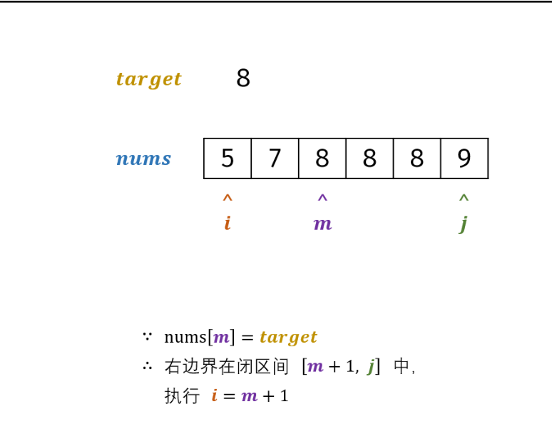
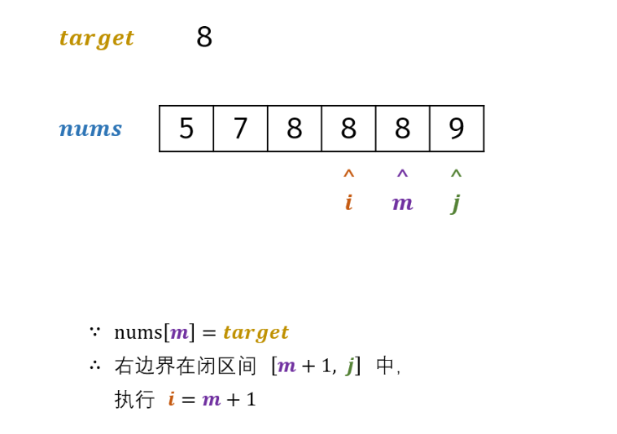
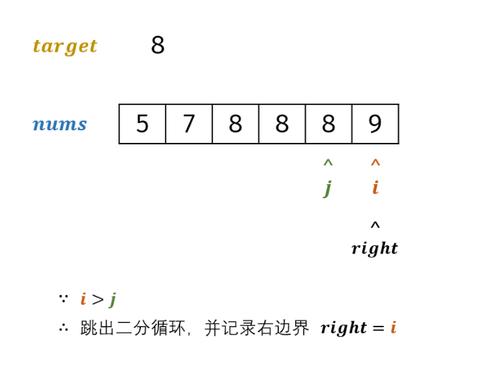

```JAVA
        int[] intArr = list.stream().mapToInt(Integer::intValue).toArray();
```


任何一个数字异或它自己都等于0

异或 相同取0 不同取1


01背包问题

i的位置是上一层的i


完全背包和多重背包

在拿第i个物品时，最大值更新为拿多少个i物品 i的位置不变


## 二分查找







num[j] 是数组最右边target 的位置