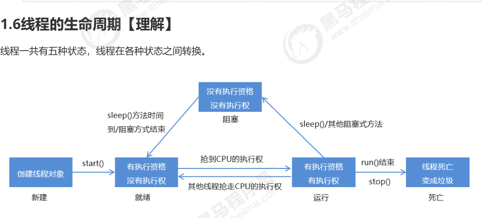
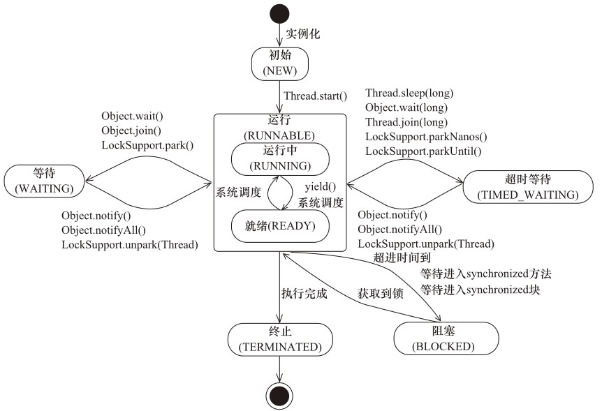
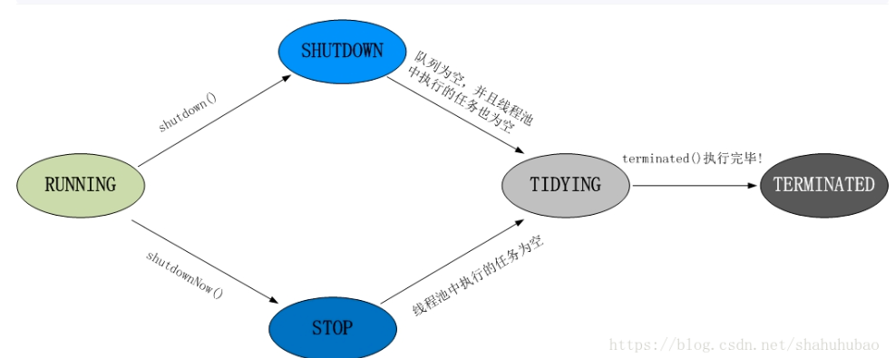
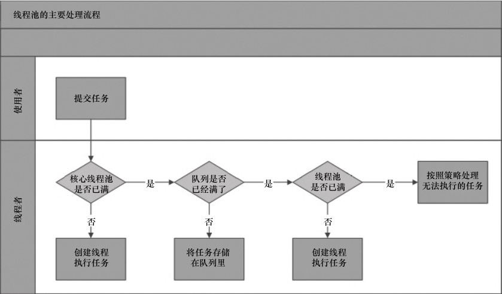

# 进程与线程

## ==**进程：** 是cpu资源分配的最小单位==


### 进程间的通讯方式（Inter-Process Communication）IPC

- 消息队列

- Semaphore

- Socket

- 管道（Pipe）：允许一个进程和另一个与他有共同祖先的进程之间进行通信

- 共享内存：多个进程访问同一块内存地址


## 线程：程序执行的最小单位

一个进程中至少包含一个线程，一个线程如果不处在进程中是无法运行的

创建一个进程的开销比线程大


### 线程间的通讯方式

- 锁
- Semaphore


### 线程的状态



- New : 新创建一个线程
- Runnable：调用了线程的start()方法，尝试获得cpu的时间片
- Running：获得了cpu时间片，开始执行该线程中对应的代码
- Block：调用sleep()、wait()方法，释放cpu时间片，使线程进入阻塞状态
- Dead：线程执行完毕，或者调用stop()


### java中的线程状态



- New: 线程初始化，未调用start()
- Runnable:调用了start(),
- Waiting:
- Time Waiting:
- Block:未获得到锁
- Terminated:

# 锁

## 	死锁

两个线程或两个以上线程都在等待对方执行完毕才能继续往下执行的时候就发生了死锁。

### 	产生死锁的必要条件

1. **互斥条件：**一个资源一次只能被一个进程使用

2. **保持和请求条件：**一个进程因请求资源而阻塞式，对已经获得资源保持不放

3. **不可剥夺条件：**进程已获得资源，在未使用完前，不能被剥夺

4. **循环等待条件：**若干进程之间形成循环等待资源关系

   ### 避免死锁

   - 破坏必要条件中的任意一个
   - 指定锁的获取顺序，并强制线程按照指定的顺序获取锁
   - 银行家算法


## 自旋锁

不阻塞线程，若能很快获得到锁，让cpu处于忙循环，而不放弃cpu时间片，不会引起线程的上下文切换

## Synchronized

1. 可重入锁：一个线程已经获得了该锁，可以再次获得锁而不会发生死锁现象
2. 保证内存可见性
3. 非公平锁
4. 条件等待队列只有一个


 synchronized获得的锁是每个对象的==Monitor对象==，类的锁则是该类对应的Class对象的Monitor对象

没有获得到锁的线程加入阻塞队列


### 同步方法

synchronized修饰方法时，表示该方法是同步方法，默认锁的是this对象，若是static的，则锁的是该类的Class对象

该类的字节码文件中的访问标志(Access_flags) 中有ACC_SYNCHRONIZED


### 同步代码块

同步代码块可以指定锁的是哪一个对象，字节码文件中可以看到monitor Enter表示同步代码块的开始，monitor Exit表示结束


### 锁的状态、锁的膨胀过程、锁的优化

- 无锁
- 偏向锁：偏向于第一个获得锁的线程，如果没有其他线程访问该同步代码，第一个线程自动获得锁；
- 轻量级锁：当锁的状态是偏向锁，并有其他线程访问该同步代码，锁升级为轻量级锁，通过==cas自旋==获得锁，不会阻塞线程，占用cpu时间片
- 重量级锁：自旋一定次数后没有获得锁，锁升级为重量级锁，阻塞线程


# 线程池

## 为什么使用线程池，优势是什么？

线程的创建与销毁时比较消耗资源的操作。java线程是使用内核线程实现的，创建线程需要进行用户态到内核态的切换，

避免资源过度消耗而重用线程执行多个任务 。

==优势：重用线程，提高响应速度，提高线程的可管理性,控制并发数量==

## 线程池状态




```java
//线程池的5种状态
private static final int RUNNING    = -1 << COUNT_BITS; //能够接收行任务，并处理已有任务
private static final int SHUTDOWN   =  0 << COUNT_BITS; //不再接收新任务，但能处理已有任务
private static final int STOP       =  1 << COUNT_BITS; //不接收新任务，且不出理已有任务，并中断正在处理的任务
private static final int TIDYING    =  2 << COUNT_BITS;//线程池中执行的任务 == 0
private static final int TERMINATED =  3 << COUNT_BITS;//线程池终结

```


## 线程池参数

```java
  public ThreadPoolExecutor(  int corePoolSize, 
                              int maximumPoolSize,
                              long keepAliveTime,
                              TimeUnit unit,
                              BlockingQueue<Runnable> workQueue,
                              ThreadFactory threadFactory,
                              RejectedExecutionHandler handler)
```




## 线程池拒绝策略

1. **AbortPolicy**: 丢弃任务并抛出RejectedExecutionException异常。
2. **DiscardPolicy:** 丢弃任务但是不抛出异常
3. **DiscardOldestPolicy：**抛弃队列头的任务，重新提交被拒绝的任务
4. **CallerRunsPolicy：**由调用线程处理该任务


